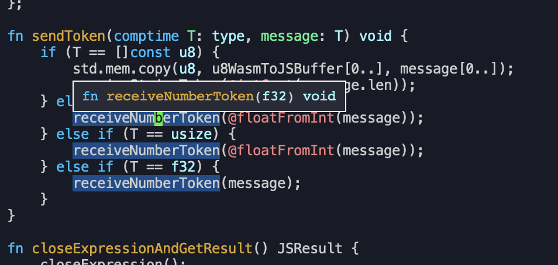
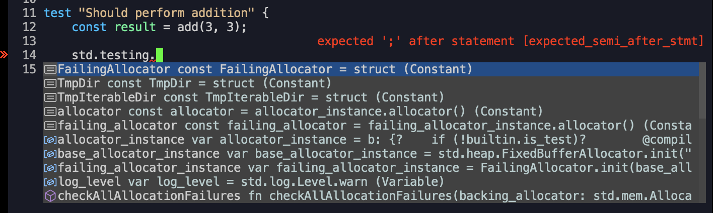

# Zig playground

I played with zig a in a web assembly context.

---

# Philosophy

Zig is a stongly typed language that aims to replace C.

https://ziglang.org/documentation/master/#Zen

> [...]
> - Runtime crashes are better than bugs.
> - Compile errors are better than runtime crashes.
> - Together we serve the users.

---

# Hello world

main.zig

```rust
const std = @import("std");

pub fn main() !void {
    const stdout = std.io.getStdOut().writer();
    try stdout.print("Hello, world!", .{});
}
```

Building:

```
zig build-exe main.zig
```

Result:

```
antoine@MacBook-Air-de-Antoine:~/prog/zig-playground/9-hello-world-non-wasm $ ./main
Hello, world!
```

---

# String interpolation

```rust
try stdout.print("Hello, {s}!\n", .{"world"});
```

---

# Testing with zig
```rust
const std = @import("std");

fn add(a: i32, b: i32) i32 {
    return a + b;
}

fn broken_add(a: i32, b: i32) i32 {
    return a + b + 42;
}

test "Should perform addition" {
    const result = add(3, 3);
    try std.testing.expectEqual(result, 6);
}

test "Should perform addition (broken)" {
    const result = broken_add(3, 3);
    try std.testing.expectEqual(result, 6);
}
```
---

# Running tests:

```
zig test main.zig
```

```
antoine@MacBook-Air-de-Antoine:~/prog/zig-playground/6-tests $ zig test main.zig
Test [2/2] test.Should perform addition (broken)... expected 48, found 6
Test [2/2] test.Should perform addition (broken)... FAIL (TestExpectedEqual)
/opt/homebrew/Cellar/zig/0.11.0/lib/zig/std/testing.zig:84:17: 0x102c007fb in expectEqual__anon_1011 (test)
                return error.TestExpectedEqual;
                ^
/Users/antoine/prog/zig-playground/6-tests/main.zig:18:5: 0x102c00a57 in test.Should perform addition (broken) (test)
    try std.testing.expectEqual(result, 6);
    ^
1 passed; 0 skipped; 1 failed.
error: the following test command failed with exit code 1:
/Users/antoine/.cache/zig/o/ac4f293727d208c2a00fd08384f1a180/test
```

After fixing code:
```
antoine@MacBook-Air-de-Antoine:~/prog/zig-playground/6-tests $ zig test main.zig
All 2 tests passed.
```

---

# Building for the browser

add.zig

```rust
extern fn print(i32) void;

export fn add(a: i32, b: i32) void {
    print(a + b);
}
```

Building:

```shell
zig build-lib add.zig -target wasm32-freestanding -dynamic -rdynamic
```

---

# Result

add.wasm
```shell
antoine@MacBook-Air-de-Antoine:~/prog/zig-playground/1-add-wasm $ cat add.wasm
envprint	A???
                    memoryadd
??#????!A!  k! $????    6
                         A!  H!  j!  H s!	A!

q!
  @
A????!
A!A????!
  ????
       ????A!  j! $????

```

---

# Using in browser

```javascript
<script type="module">
  const importObject = {
      env: {
          print: (message) => console.log(message),
      }
  };

  WebAssembly.instantiateStreaming(fetch("add.wasm"), importObject).then(
      (results) => {
          results.instance.exports.add(4, 5);
      },
  );
</script>
```


---

# Communication with browser

 - Function calls
 - ArrayBuffer
 - Mix of function calls and buffers

---

## Example buffer creation


Zig:
```rust
const buffer_size: i32 = 2048;
export var u8buffer: [buffer_size]u8 = undefined;

// [...]
    std.mem.copy(u8, u8buffer[0..], message[0..]);
// [...]
```

---

Javascript:
```javascript
WebAssembly.instantiateStreaming(fetch("main.wasm"), importObject).then(
    (results) => {
        const memory = new Uint8Array(results.instance.exports.memory);
        const u8bufferPointer = results.instance.exports.u8buffer;

        const messageBytes = memory[u8bufferPointer.value];
        const decoder = new TextDecoder("utf-8");
        const start = u8WasmToJSBufferPointer.value;
        const slice = memory.buffer.slice(start);
        const str = decoder.decode(slice);

        console.log(str);
    }
);
```

---

## Mix of function calls and buffers

The previous example was a simplification.

Reality:
 - JS to Zig function call: getRandomString()
 - ZIG: place string in memory.
 - ZIG to JS function call: stringIsAvailable(size)
 - JS: read memory and decode


---

# Comptime

```rust
fn sendToken(comptime T: type, message: T) void {
    if (T == []const u8) {
        std.mem.copy(u8, u8WasmToJSBuffer[0..], message[0..]);
        receiveStringToken(@intCast(message.len));
    } else if (T == u8) {
        receiveNumberToken(@floatFromInt(message));
    } else if (T == usize) {
        receiveNumberToken(@floatFromInt(message));
    } else if (T == f32) {
        receiveNumberToken(message);
    }
}
```

---

# ZLS

Zig has a langage server, so we can get type annotation and autocompletion in our editors.



---



---

# Not explored yet

 - Zig package manager
 - Linking with other programming languages in wasm
   - Actually I tried, but it's not as simple as I thought

---

# Conclusions so far:

Zig:
 - 👍 Zig is pretty nice and simple, [known to be performant](https://zackoverflow.dev/writing/unsafe-rust-vs-zig/)
 - 👍 tests are embedded in the language.
 - 👍 comptime
 - 👎 less mature - not 1.0 yet
    - No source maps in browser :(

Webassembly
 - 👍 Wasm is pretty nice and simple to use actually.
 - 👍 Multiple languages can target it
   - go, c, c++, rust, zig, typescript (assemblyscript)

---

TLDR:
- Webassembly: definitely do more
- Zig: Maybe prefer Rust for larger projects and Zig for performance-critical code.
  (until Zig ecosystem grows)
